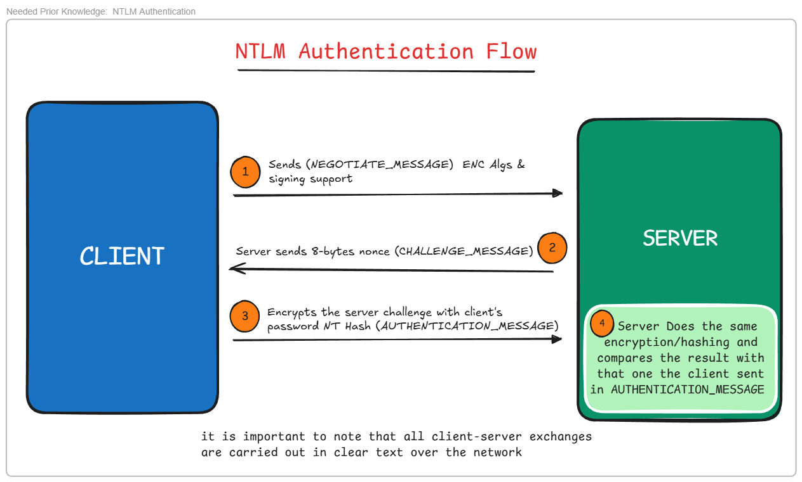

# NTLM Relay Attacks
Before we start we need to know how NTLM authentication works
## How does NTLM Authentication work?
1. the Client sends a `NEGOTIATE_MESSAGE` to the server that he wants to authenticate to, and this message Contains the Encryption and signing algorithms that the client support.
2. The Server Replies with `CHALLENGE_MESSAGE` which contains a Generated a 8-bytes nonce.
3. The Client Encrypts this challenge with his Password hash (NT Hash), and then sends it Back to the server in `AUTHENTICATION_MESSAGE`
4. Finally the server does the same encryption/signing process and use the compare the computer result with the Client's Computed one sent in the ` AUTHENTICATION_MESSAGE`, and if both match then the client is autheticated.
  
#### here is a simple vizualisation for the authentication flow

### What is NTLM Relay attack?
- it is a type of interception attack (MiTM), where the attaker poisons the LLMNR/NTBS request from the user and make him encrypt a challenge that the attacker has requested from the target server, and then sends this encrypted challenge back to the server for authentication, and there the attacker can use this authernticated user session to interact with the target server.
- Requirements
  - SMB Signing is Disabled **(Signing False)**
  - The user that we are relaying his NTLM auth request **MUST be an admin on the TARGET MACHINE**

#### Attack Flow
1. Attacker puts himself inside the network / in the middle between the Victim user and the target server
2. Wait for / Coerce the Victim user to authenticate on the attacker machine, wait for te victim to send his `NEGOTIATE_MESSAGE`
3. Initiate the NTLM authentication flow, and send the `NEGOTIATE_MESSAGE` acquired from the user to the target server.
4. Captures the  `CHALLENGE_MESSAGE` Reply from the Target server
5. Sends the `CHALLENGE_MESSAGE` to the Victim user
6. attacker Captures the `AUTHENTICATION_MESSAGE` from the user and pass it to the server
7. Server validates the valid encrypted challenge in the `AUTHENTICATION_MESSAGE`.
8. Now the attacker can Perform any actions desired in the session opened by the server.

---
### LLMNR/NTB-NS Poisoning
_**(Local Link Multicast Name Resolution and NetBIOS Name Service) these are two name Services used to resolve hostnames to ip address when DNS fails**_
- LLMNR/NTB-NS is an automatic Discovery protocol, which work when the DNS query fails to supply the client with his lookup, the NTB-NS/LLMNR Broadcasts the DNS lookup to everybody in the network. ("Does anybody in the network know this domain name?")
- IMPORTANT NOTE: `all “.Scf”, “.url”, “.lnk” files pointing to an image (png, ico, jpg) accessible on a network share not resolved by DNS will automatically trigger an LLMNR/Netbios request as soon as the user accesses the folder containing these files. Windows will try to retrieve a thumbnail of the image and display it in the file explorer.`
  
#### Responder
We can use Responder to poison the LLMNR Query, here is how it works:
1. user enter an invalid Network address name `\\obad\` in top bar of the file explorer or even in the Browser.
2. the PC sends a DNS query looking for the network address for `\\obad\`
3. DNS server fails to resolve `\\obad\`
4. Client then sends a Broadcast LLMNR request asking Hosts in the network for an ip resoloution for `\\obad\`
5. surely all will fail to resolve it (hopefully), and then `Responder` Comes in and replies to the Client, and tell him yes sure, i have the corrosponding ip address for this name.
6. Client asks the Attacker machine (that has the Responder listening) and start the NTLM authentication.
7. Now Responder can continue the NTLM auth flow with the CLient and lastly get the `AUTHENTICATION_MESSAGE` from the user
8. Attacker can try to crack the NT hash of the Client using the Encypted challenge within the `AUTHENTICATION_MESSAGE`, using john / Hashcat. Else the Attacker can relay the attack to another target server

## Resources
- https://www.vaadata.com/blog/understanding-ntlm-authentication-and-ntlm-relay-attacks/
  